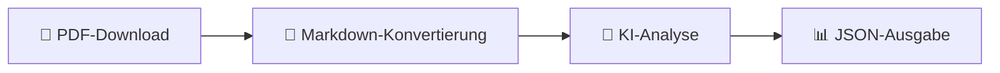

<div align="center">

# 🤖 rubot

**KI-gestützter Münchener Rathaus-Umschau PDF-Prozessor**

[](https://www.python.org/downloads/)
[](https://www.gnu.org/licenses/agpl-3.0)
[](https://github.com/rmoriz/rubot/pkgs/container/rubot)
[](https://github.com/rmoriz/rubot/actions)

*Automatisiere die Extraktion und Analyse der offiziellen städtischen Ankündigungen Münchens*

📖 [English README](README_EN.md)

[🚀 Schnellstart](#-schnellstart) • [📖 Dokumentation](#-konfiguration) • [🐳 Docker](#-docker-verwendung) • [🤝 Mitwirken](#-mitwirken)

</div>

---

## ✨ Was ist rubot?

`rubot` ist ein leistungsstarkes CLI-Tool, das die Rathaus-Umschau PDFs Münchens in strukturierte, KI-analysierte Daten umwandelt. Perfekt für Journalisten, Forscher und Bürger, die über städtische Entscheidungen und Veranstaltungen informiert bleiben wollen.

### 🔄 Wie es funktioniert



1. **📥 Lädt** Rathaus-Umschau PDFs von der offiziellen Münchner Website herunter
2. **🔄 Konvertiert** PDFs in sauberes Markdown mit `PyMuPDF`
3. **🧠 Analysiert** Inhalt mit Ihrer Wahl eines KI-Modells über OpenRouter
4. **📤 Gibt** strukturiertes JSON mit extrahierten Ankündigungen und Veranstaltungen aus

## 🚀 Schnellstart

### 📋 Voraussetzungen

- 🐍 **Python 3.13+**
- 🔑 **OpenRouter API-Schlüssel** ([Hier erhalten](https://openrouter.ai/))
- 💾 **1-2GB RAM** (für die PDF-Konvertierung mit `PyMuPDF`, auch in Docker)

### ⚡ Einzeilige Installation

```bash
curl -sSL https://raw.githubusercontent.com/rmoriz/rubot/main/scripts/install.sh | bash
```

### 🛠️ Manuelle Installation

<details>
<summary>Klicken für manuelle Installationsschritte</summary>

```bash
# Repository klonen
git clone https://github.com/rmoriz/rubot.git
cd rubot

# Virtuelle Umgebung erstellen
python -m venv rubot-env
source rubot-env/bin/activate  # Unter Windows: rubot-env\Scripts\activate

# Abhängigkeiten installieren
pip install -e .
```

</details>

## ⚙️ Konfiguration

### 🔐 Erforderliche Umgebungsvariablen

```bash
# 🔑 API-Konfiguration (erforderlich)
OPENROUTER_API_KEY=ihr_openrouter_api_schlüssel_hier
DEFAULT_MODEL=ihr_bevorzugtes_modell_hier

# 💬 System-Prompt (erforderlich - wählen Sie einen)
DEFAULT_SYSTEM_PROMPT="Analysieren Sie den folgenden Rathaus-Umschau-Inhalt..."
# ODER eine Prompt-Datei verwenden:
# DEFAULT_PROMPT_FILE=prompts/default.txt
```

### 🔧 Optionale Konfiguration

<details>
<summary>Alle verfügbaren Umgebungsvariablen</summary>

```bash
# 🌐 Netzwerk-Einstellungen
REQUEST_TIMEOUT=120          # PDF-Download-Timeout in Sekunden
OPENROUTER_TIMEOUT=120       # OpenRouter API-Timeout in Sekunden

# 💾 Cache-Einstellungen
CACHE_ENABLED=true           # Cache aktivieren/deaktivieren
CACHE_DIR=/tmp/rubot_cache   # Benutzerdefinierter Cache-Ordner
CACHE_MAX_AGE_HOURS=24       # Cache-Alter in Stunden

# 🧹 Cache-Cleanup-Einstellungen
CACHE_CLEANUP_DAYS=14        # Cache-Dateien nach N Tagen löschen (0 = deaktivieren)
SKIP_CLEANUP=1               # Automatischen Cache-Cleanup überspringen

# 📄 Verarbeitungseinstellungen
DEFAULT_TEMPERATURE=0.8      # LLM-Temperatur (0.0-1.0)
DEFAULT_MAX_TOKENS=4000      # Maximale Tokens für LLM-Antwort

# 📊 Logging
LOG_LEVEL=INFO               # DEBUG, INFO, WARNING, ERROR
```

</details>

## 🎯 Verwendung

### 🏃‍♂️ Grundlegende Verwendung

```bash
# 📅 Heutige Rathaus-Umschau verarbeiten
rubot

# 🗓️ Bestimmtes Datum verarbeiten
rubot --date 2025-07-17

# 💾 In Datei speichern
rubot --date 2025-07-17 --output ergebnis.json

# 🎨 Benutzerdefinierten Prompt und Modell verwenden
rubot --date 2025-07-17 --prompt benutzer_prompt.txt --model gpt-4

# 🧹 Cache-Cleanup nach 7 Tagen
rubot --date 2025-07-17 --cache-cleanup-days 7

# 🚫 Cache-Cleanup überspringen
rubot --date 2025-07-17 --skip-cleanup
```

### 🛠️ CLI-Optionen

| Option | Beschreibung | Standard | Umgebungsvariable |
|--------|-------------|----------|-------------------|
| `--date` | 📅 Datum im JJJJ-MM-TT-Format | heute | - |
| `--output` | 📁 Ausgabedateipfad | stdout | - |
| `--prompt` | 📝 Pfad zur System-Prompt-Datei | - | DEFAULT_PROMPT_FILE |
| `--model` | 🤖 OpenRouter-Modell-ID | - | DEFAULT_MODEL |
| `--temperature` | 🌡️ LLM-Temperatur | 0.8 | DEFAULT_TEMPERATURE |
| `--max-tokens` | 🔢 Maximale Tokens für Antwort | 4000 | DEFAULT_MAX_TOKENS |
| `--config` | ⚙️ Pfad zur Config-Datei | .env | - |
| `--no-cache` | 🚫 Cache deaktivieren | false | CACHE_ENABLED=false |
| `--cache-dir` | 📂 Benutzerdefinierter Cache-Ordner | System-Temp | CACHE_DIR |
| `--cache-cleanup-days` | 🧹 Cache-Dateien nach N Tagen löschen | 14 | CACHE_CLEANUP_DAYS |
| `--skip-cleanup` | 🚫 Cache-Cleanup überspringen | false | SKIP_CLEANUP=1 |
| `--verbose` | 🔍 Debug-Ausgabe aktivieren | false | LOG_LEVEL=DEBUG |
| `-h/--help` | ❓ Hilfemeldung anzeigen | - | - |
| `--version` | 🔢 Versionsnummer anzeigen | - | - |

## 🐳 Docker-Verwendung

### 🚚 Vorgefertigtes Image verwenden

```bash
docker run --rm \
  -e OPENROUTER_API_KEY=ihr_schlüssel \
  -e DEFAULT_MODEL=ihr_modell \
  -e CACHE_CLEANUP_DAYS=7 \
  -v $(pwd)/output:/app/output \
  ghcr.io/rmoriz/rubot:latest \
  --date 2024-01-15 --output /app/output/ergebnis.json
```

### 🐙 Docker Compose

<details>
<summary>Klicken für docker-compose.yml</summary>

```yaml
version: '3.8'
services:
  rubot:
    image: ghcr.io/rmoriz/rubot:latest
    environment:
      - OPENROUTER_API_KEY=${OPENROUTER_API_KEY}
      - DEFAULT_MODEL=${DEFAULT_MODEL}
      - CACHE_ENABLED=true
      - CACHE_MAX_AGE_HOURS=24
      - CACHE_CLEANUP_DAYS=14
    volumes:
      - ./cache:/app/cache
      - ./output:/app/output
    command: ["--date", "2024-01-15", "--output", "/app/output/ergebnis.json", "--verbose"]
```

</details>

## 🧠 Modell-Auswahl

rubot funktioniert mit **jedem OpenRouter-kompatiblen Modell**. Wählen Sie basierend auf Ihren Bedürfnissen:

### 🏆 Empfohlene Modelle

| Modell | Anbieter | Beste für | Kosten |
|-------|----------|----------|------|
| `moonshotai/kimi-k2:free` | Moonshot AI | 📝 Textanalyse, Nachdenken | Kostenlos |
| `x-ai/grok-3-mini` | xAI | 🎯 Schnell, zuverlässig | Billig |

> 💡 **Tipp**: Starten Sie mit dem kostenlosen `moonshotai/kimi-k2:free` für Textanalyse.

📋 Sehen Sie die vollständige Liste unter [OpenRouter Models](https://openrouter.ai/models)

## 📊 Ausgabeformat

Das Tool gibt **strukturiertes JSON** mit extrahierter Information aus:

<details>
<summary>📋 <strong>Beispielausgabe</strong></summary>

```json
{
  "issue": "134",
  "year": "2025",
  "id": "2025-07-17",
  "summary": "Rathaus-Umschau 134/2025: Sanierung Markt Wiener Platz, Neubau Thomas-Wimmer-Haus in Laim...",
  "social_media_post": "# KI-Kommentar zur Rathaus-Umschau 134 vom 17.07.2025...",
  "announcements": [
    {
      "title": "Markt am Wiener Platz wird saniert",
      "description": "Großreparatur statt Neubau: 3 Mio € Eigenfinanzierung...",
      "category": "construction",
      "date": "Ende 2027",
      "location": "Wiener Platz, Haidhausen"
    }
  ],
  "events": [
    {
      "title": "Eröffnung naturnaher Pausenhof Guardinistraße 60",
      "date": "18. Juli 2025",
      "time": "14:00",
      "location": "Grund- und Mittelschule Guardinistraße 60",
      "description": "Erster naturnaher Pausenhof Münchens mit Bürgermeisterin Dietl"
    }
  ],
  "important_dates": [
    {
      "description": "Akkreditierung für OEZ-Gedenkveranstaltung",
      "date": "19. Juli 2025",
      "details": "für Medienvertreter*innen"
    }
  ]
}
```

</details>

### 📈 Datenstruktur

- **📝 Zusammenfassung**: KI-generierter Überblick über das Dokument
- **📢 Ankündigungen**: Städtische Entscheidungen, Politikänderungen, öffentliche Bekanntmachungen
- **🎉 Veranstaltungen**: Bevorstehende Veranstaltungen, Treffen, öffentliche Versammlungen  
- **📊 Metadaten**: Verarbeitungsinformationen und Quelldetails

## 👨‍💻 Entwicklung

### 🧪 Tests ausführen

```bash
# Alle Tests ausführen
pytest

# Mit Abdeckung ausführen
pytest --cov=rubot --cov-report=html

# Spezifische Testdatei ausführen
pytest tests/test_simple.py -v
```

### 🔍 Code-Qualität

```bash
# 🧹 Linting
flake8 rubot/

# 🔍 Typ-Überprüfung  
mypy rubot/

# ✨ Formatierung
black rubot/
```

### 📁 Projektstruktur

```
rubot/
├── 🤖 rubot/
│   ├── __init__.py
│   ├── __main__.py
│   ├── cli.py          # 🖥️ CLI-Schnittstelle
│   ├── config.py       # ⚙️ Konfigurationsverwaltung
│   ├── downloader.py   # 📥 PDF-Download
│   ├── llm.py          # 🧠 OpenRouter API-Integration
│   ├── cache.py        # 💾 Cache-Funktionalität
│   ├── retry.py        # 🔄 Wiederholungsmechanismen
│   ├── models.py       # 📊 Datenmodelle
│   ├── logger.py       # 📝 Logging-Konfiguration
│   └── utils.py        # 🛠️ Hilfsfunktionen
├── 🧪 tests/           # Test-Suite
├── 📚 examples/        # Verwendungsbeispiele
├── 💬 prompts/         # System-Prompt-Vorlagen
└── 📖 docs/            # Dokumentation
```

---

## 🤝 Mitwirken

Wir heißen Beiträge willkommen! So können Sie loslegen:

1. 🍴 **Forken** Sie das Repository
2. 🌿 **Erstellen** Sie einen Feature-Branch (`git checkout -b feature/amazing-feature`)
3. ✨ **Machen** Sie Ihre Änderungen
4. 🧪 **Hinzufügen** Sie Tests für neue Funktionalitäten
5. ✅ **Stellen** Sie sicher, dass alle Tests bestehen
6. 📝 **Committen** Sie Ihre Änderungen (`git commit -m 'Add amazing feature'`)
7. 🚀 **Pushen** Sie zum Branch (`git push origin feature/amazing-feature`)
8. 🎯 **Reichen** Sie einen Pull-Request ein

### 💡 Ideen für Beiträge

- 🌍 **Internationalisierung**: Unterstützung für andere Sprachen
- 📊 **Exportformate**: CSV, Excel, XML Ausgabeoptionen
- 🔌 **Integrationen**: Slack, Discord, E-Mail-Benachrichtigungen
- 🎨 **UI**: Web-Schnittstelle oder Desktop-App
- 📈 **Analytics**: Trendanalyse und Berichterstattung

---

## 📄 Lizenz

Dieses Projekt ist unter der **GNU Affero General Public License v3.0** lizenziert - siehe die [LICENSE](LICENSE)-Datei für Details.

### ✅ Lizenz

Dieses Projekt verwendet `PyMuPDF` (AGPL-3.0) für die PDF-zu-Markdown-Konvertierung. Die AGPL-Lizenz erfordert, dass alle abgeleiteten Werke ebenfalls unter AGPL veröffentlicht werden.

## 🆘 Support & Community

<div align="center">

[](https://github.com/rmoriz/rubot/issues)
[](https://github.com/rmoriz/rubot/discussions)
[](https://github.com/rmoriz/rubot/stargazers)

**[🐛 Bug melden](https://github.com/rmoriz/rubot/issues/new?template=bug_report.md)** • **[💡 Feature anfordern](https://github.com/rmoriz/rubot/issues/new?template=feature_request.md)** • **[💬 Diskussionen](https://github.com/rmoriz/rubot/discussions)**

</div>

---

<div align="center">

**Gemacht mit ❤️ für die Münchner Community**

*Wenn Sie rubot nützlich finden, erwägen Sie bitte, ihm einen ⭐ auf GitHub zu geben!*

</div>