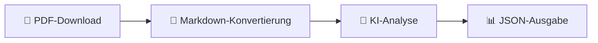

<div align="center">

# 🤖 rubot

**KI-gestützter Münchener Rathaus-Umschau PDF-Prozessor**

[](https://www.python.org/downloads/)
[](https://www.gnu.org/licenses/gpl-3.0)
[](https://github.com/rmoriz/rubot/pkgs/container/rubot)
[](https://github.com/rmoriz/rubot/actions)

*Automatisiere die Extraktion und Analyse der offiziellen städtischen Ankündigungen Münchens*

📖 [English README](README_EN.md)

[🚀 Schnellstart](#-schnellstart) • [📖 Dokumentation](#-konfiguration) • [🐳 Docker](#-docker-verwendung) • [🤝 Mitwirken](#-mitwirken)

</div>

---

## ✨ Was ist rubot?

`rubot` ist ein leistungsstarkes CLI-Tool, das die Rathaus-Umschau PDFs Münchens in strukturierte, KI-analysierte Daten umwandelt. Perfekt für Journalisten, Forscher und Bürger, die über städtische Entscheidungen und Veranstaltungen informiert bleiben wollen.

### 🔄 Wie es funktioniert



1. **📥 Lädt** Rathaus-Umschau PDFs von der offiziellen Münchner Website herunter
2. **🔄 Konvertiert** PDFs in sauberes Markdown mit `marker-pdf`
3. **🧠 Analysiert** Inhalt mit Ihrer Wahl eines KI-Modells über OpenRouter
4. **📤 Gibt** strukturiertes JSON mit extrahierten Ankündigungen und Veranstaltungen aus

## 🚀 Schnellstart

### 📋 Voraussetzungen

- 🐍 **Python 3.13+**
- 🔑 **OpenRouter API-Schlüssel** ([Hier erhalten](https://openrouter.ai/))

### ⚡ Einzeilige Installation

```bash
curl -sSL https://raw.githubusercontent.com/rmoriz/rubot/main/scripts/install.sh | bash
```

### 🛠️ Manuelle Installation

<details>
<summary>Klicken für manuelle Installationsschritte</summary>

```bash
# Repository klonen
git clone https://github.com/rmoriz/rubot.git
cd rubot

# Virtuelle Umgebung erstellen
python -m venv rubot-env
source rubot-env/bin/activate  # Unter Windows: rubot-env\Scripts\activate

# Abhängigkeiten installieren
pip install -r requirements.txt
pip install git+https://github.com/datalab-to/marker.git
```

</details>

## ⚙️ Konfiguration

Erstellen Sie eine `.env`-Datei mit Ihren Einstellungen:

<details>
<summary>📝 <strong>Erforderliche Konfiguration</strong></summary>

```bash
# 🔑 API-Konfiguration (erforderlich)
OPENROUTER_API_KEY=ihr_openrouter_api_schlüssel_hier
DEFAULT_MODEL=ihr_bevorzugtes_modell_hier

# 💬 System-Prompt (erforderlich - wählen Sie einen)
DEFAULT_SYSTEM_PROMPT="Analysieren Sie den folgenden Rathaus-Umschau-Inhalt..."
# ODER eine Prompt-Datei verwenden:
# DEFAULT_PROMPT_FILE=prompts/default.txt
```

</details>

<details>
<summary>🔧 <strong>Optionale Konfiguration</strong></summary>

```bash
# 🌐 Netzwerk-Einstellungen
REQUEST_TIMEOUT=120
OPENROUTER_TIMEOUT=120
MARKER_TIMEOUT=600
MAX_RETRIES=3
RETRY_DELAY=1.0

# 💾 Cache-Einstellungen
CACHE_ENABLED=true
CACHE_DIR=
CACHE_MAX_AGE_HOURS=24

# 📄 Verarbeitungseinstellungen
MAX_PDF_PAGES=100

# 📊 Ausgabeeinstellungen
OUTPUT_FORMAT=json
JSON_INDENT=2
```

</details>

## 🎯 Verwendung

### 🏃‍♂️ Grundlegende Verwendung

```bash
# 📅 Heutige Rathaus-Umschau verarbeiten
rubot

# 🗓️ Bestimmtes Datum verarbeiten
rubot --date 2025-07-17

# 💾 In Datei speichern
rubot --date 2025-07-17 --output ergebnis.json

# 🎨 Benutzerdefinierten Prompt und Modell verwenden
rubot --date 2025-07-17 --prompt benutzer_prompt.txt --model gpt-4
```

### 🛠️ CLI-Optionen

| Option | Beschreibung | Standard |
|--------|-------------|----------|
| `--date` | 📅 Datum im JJJJ-MM-TT-Format | heute |
| `--output` | 📁 Ausgabedateipfad | stdout |
| `--prompt` | 📝 Pfad zur System-Prompt-Datei | - |
| `--model` | 🤖 OpenRouter-Modell-ID | aus Konfiguration |
| `--temperature` | 🌡️ LLM-Temperatur | 0.1 |
| `--max-tokens` | 🔢 Maximale Tokens für Antwort | 4000 |
| `--verbose` | 🔍 Debug-Ausgabe aktivieren | false |
| `--help` | ❓ Hilfemeldung anzeigen | - |

## 🐳 Docker-Verwendung

### 🚚 Vorgefertigtes Image verwenden

```bash
docker run --rm \\
  -e OPENROUTER_API_KEY=ihr_schlüssel \\
  -e DEFAULT_MODEL=ihr_modell \\
  -v $(pwd)/output:/app/output \\
  ghcr.io/rmoriz/rubot:latest \\
  --date 2024-01-15 --output /app/output/ergebnis.json
```

### 🐙 Docker Compose

<details>
<summary>Klicken für docker-compose.yml</summary>

```yaml
version: '3.8'
services:
  rubot:
    image: ghcr.io/rmoriz/rubot:latest
    environment:
      - OPENROUTER_API_KEY=${OPENROUTER_API_KEY}
      - DEFAULT_MODEL=${DEFAULT_MODEL}
      - CACHE_ENABLED=true
      - CACHE_MAX_AGE_HOURS=24
    volumes:
      - ./cache:/app/cache
      - ./output:/app/output
    command: ["--date", "2024-01-15", "--output", "/app/output/ergebnis.json", "--verbose"]
```

</details>

## 🧠 Modell-Auswahl

rubot funktioniert mit **jedem OpenRouter-kompatiblen Modell**. Wählen Sie basierend auf Ihren Bedürfnissen:

### 🏆 Empfohlene kostenlose Modelle

| Modell | Anbieter | Beste für | Kosten |
|-------|----------|----------|------|
| `moonshotai/kimi-k2:free` | Moonshot AI | 📝 Textanalyse, Nachdenken | Kostenlos |
| `x-ai/grok-3-mini` | xAI | 🎯 Schnell, zuverlässig | Kostenlos |

> 💡 **Tipp**: Diese kostenlosen Modelle bieten exzellente Leistung für Rathaus-Umschau-Analysen. Beginnen Sie mit `moonshotai/kimi-k2:free` für umfassende Textanalyse.

📋 Sehen Sie die vollständige Liste unter [OpenRouter Models](https://openrouter.ai/models)

## 📊 Ausgabeformat

Das Tool gibt **strukturiertes JSON** mit extrahierter Information aus:

<details>
<summary>📋 <strong>Beispielausgabe</strong></summary>

```json
{
  "issue": "134",
  "year": "2025",
  "id": "2025-07-17",
  "summary": "Rathaus-Umschau 134/2025: Sanierung Markt Wiener Platz, Neubau Thomas-Wimmer-Haus in Laim, neue Feuerwache 3 in Laim, Gedenkveranstaltung 9. Jahrestag OEZ-Attentat, Baustellen-Radverkehr, Vandalismus Zierbrunnen Harras, Ausstellungen Mode- und Designschulen.",
  "social_media_post": "# KI-Kommentar zur Rathaus-Umschau 134 vom 17.07.2025\n\n## Baustellen-Radverkehr: Endlich Priorität?\nGrüne fordern Fuß- & Radverkehr vor MIV bei Baustellen. MobRef antwortet: „Ist schon lange so.“ Wirklich? Dann zeigt’s mal, statt nur davon zu reden!\n\n## Feuerwache 3 Laim: 10-Meter-Fahrrad-Freistreifen\nImmerhin: Für den neuen Standort wird ein 10 m breiter Streifen für „künftigen Fußgänger- und Fahrradsteg“ freigehalten. Bleibt nur zu hoffen, dass daraus mehr wird als ein Schmierzettel im Plan.\n\nQuelle: https://ru.muenchen.de/2025/134",
  "announcements": [
    {
      "title": "Markt am Wiener Platz wird saniert",
      "description": "Großreparatur statt Neubau: 3 Mio € Eigenfinanzierung, Interimsmarkt ab Frühjahr 2026, Fertigung Ende 2027",
      "category": "construction",
      "date": "Ende 2027",
      "location": "Wiener Platz, Haidhausen"
    },
    {
      "title": "Neubau Thomas-Wimmer-Haus in der „Alten Heimat“",
      "description": "159 barrierefreie Wohnungen + Tagespflege, Baubeginn Herbst 2026, Fertigstellung Ende 2029",
      "category": "construction",
      "date": "Ende 2029",
      "location": "Laim"
    },
    {
      "title": "Neue Feuerwache 3 in Laim",
      "description": "Ersatz für Schwanthalerhöhe, Generalübernehmer-Verfahren, Baustart nach DB-Räumung Ende 2026",
      "category": "construction",
      "date": "Ende 2026",
      "location": "Landsberger Str. 332"
    },
    {
      "title": "Zierbrunnen am Harras wieder beschädigt",
      "description": "Vandalismus kostet 15 000 €, Wiederinbetriebnahme Ende Juli geplant",
      "category": "public services",
      "date": "Ende Juli 2025",
      "location": "Harras"
    }
  ],
  "events": [
    {
      "title": "Eröffnung naturnaher Pausenhof Guardinistraße 60",
      "date": "18. Juli 2025",
      "time": "14:00",
      "location": "Grund- und Mittelschule Guardinistraße 60",
      "description": "Erster naturnaher Pausenhof Münchens mit Bürgermeisterin Dietl"
    },
    {
      "title": "Enthüllung „Ort der Demokratie“ Prannerstraße 8",
      "date": "18. Juli 2025",
      "time": "15:00",
      "location": "Foyer MEAG, Prannerstraße 8",
      "description": "Ehrung durch Landtagspräsidentin Aigner und OB Reiter"
    },
    {
      "title": "Kunstprojekt „Menzinga“",
      "date": "18. Juli 2025",
      "time": "16:00",
      "location": "Fußgänger-Unterführung S-Bahnhof Untermenzing",
      "description": "800 m² Wandbild von Martin Blumöhr"
    },
    {
      "title": "Gedenken Reichsbahnlager Neuaubing",
      "date": "18. Juli 2025",
      "time": "16:00",
      "location": "Erinnerungsort Neuaubing, Ehrenbürgstraße 9",
      "description": "Gedenkzeichen für 11 Zwangsarbeiter*innen"
    },
    {
      "title": "Eröffnung Spielplatz Gollierplatz",
      "date": "21. Juli 2025",
      "time": "12:30",
      "location": "Gollierplatz",
      "description": "Neuer inklusiver Spielplatz mit Wasserspielbereich"
    },
    {
      "title": "JEF-EU-Planspiel im Landtag",
      "date": "21. Juli 2025",
      "time": "14:00",
      "location": "Bayerischer Landtag, Max-Planck-Straße 1",
      "description": "100 Schüler*innen simulieren EU-Parlament"
    },
    {
      "title": "Designpreis „Goldenes Pony“",
      "date": "22. Juli 2025",
      "time": "20:00",
      "location": "Roßmarkt 15",
      "description": "Verleihung mit Stadtschulrat Kraus"
    },
    {
      "title": "Modenschau Meisterschule für Mode",
      "date": "24. Juli 2025",
      "time": "20:00",
      "location": "Muffathalle, Zellstraße 4",
      "description": "Premiere der Kollektionen „Breaking Patterns“"
    }
  ],
  "important_dates": [
    {
      "description": "Akkreditierung für OEZ-Gedenkveranstaltung",
      "date": "19. Juli 2025",
      "details": "für Medienvertreter*innen"
    },
    {
      "description": "Akkreditierung Modenschau",
      "date": "23. Juli 2025, 16:00",
      "details": "bei presse.rbs@muenchen.de"
    },
    {
      "description": "Ausstellung Wettbewerbsergebnisse Ramersdorf",
      "date": "7. August 2025",
      "details": "täglich 8–20 Uhr, Blumenstraße 28b"
    }
  ]
}
```

</details>

### 📈 Datenstruktur

- **📝 Zusammenfassung**: KI-generierter Überblick über das Dokument
- **📢 Ankündigungen**: Städtische Entscheidungen, Politikänderungen, öffentliche Bekanntmachungen
- **🎉 Veranstaltungen**: Bevorstehende Veranstaltungen, Treffen, öffentliche Versammlungen  
- **📊 Metadaten**: Verarbeitungsinformationen und Quelldetails

## 👨‍💻 Entwicklung

<details>
<summary>🧪 <strong>Tests ausführen</strong></summary>

```bash
# Alle Tests ausführen
pytest

# Mit Abdeckung ausführen
pytest --cov=rubot --cov-report=html

# Spezifische Testdatei ausführen
pytest tests/test_simple.py -v
```

</details>

<details>
<summary>🔍 <strong>Code-Qualität</strong></summary>

```bash
# 🧹 Linting
flake8 rubot/

# 🔍 Typ-Überprüfung  
mypy rubot/

# ✨ Formatierung
black rubot/
```

</details>

<details>
<summary>📁 <strong>Projektstruktur</strong></summary>

```
rubot/
├── 🤖 rubot/
│   ├── __init__.py
│   ├── __main__.py
│   ├── cli.py          # 🖥️ CLI-Schnittstelle
│   ├── config.py       # ⚙️ Konfigurationsverwaltung
│   ├── downloader.py   # 📥 PDF-Download
│   ├── marker.py       # 🔄 PDF zu Markdown Konvertierung
│   ├── llm.py          # 🧠 OpenRouter API-Integration
│   ├── cache.py        # 💾 Cache-Funktionalität
│   ├── retry.py        # 🔄 Wiederholungsmechanismen
│   ├── models.py       # 📊 Datenmodelle
│   └── utils.py        # 🛠️ Hilfsfunktionen
├── 🧪 tests/           # Test-Suite
├── 📚 examples/        # Verwendungsbeispiele
├── 💬 prompts/         # System-Prompt-Vorlagen
└── 📖 docs/            # Dokumentation
```

</details>

---

## 🤝 Mitwirken

Wir heißen Beiträge willkommen! So können Sie loslegen:

1. 🍴 **Forken** Sie das Repository
2. 🌿 **Erstellen** Sie einen Feature-Branch (`git checkout -b feature/amazing-feature`)
3. ✨ **Machen** Sie Ihre Änderungen
4. 🧪 **Hinzufügen** Sie Tests für neue Funktionalitäten
5. ✅ **Stellen** Sie sicher, dass alle Tests bestehen
6. 📝 **Committen** Sie Ihre Änderungen (`git commit -m 'Add amazing feature'`)
7. 🚀 **Pushen** Sie zum Branch (`git push origin feature/amazing-feature`)
8. 🎯 **Reichen** Sie einen Pull-Request ein

### 💡 Ideen für Beiträge

- 🌍 **Internationalisierung**: Unterstützung für andere Sprachen
- 📊 **Exportformate**: CSV, Excel, XML Ausgabeoptionen
- 🔌 **Integrationen**: Slack, Discord, E-Mail-Benachrichtigungen
- 🎨 **UI**: Web-Schnittstelle oder Desktop-App
- 📈 **Analytics**: Trendanalyse und Berichterstattung

---

## 📄 Lizenz

Dieses Projekt ist unter der **GNU General Public License v3.0** lizenziert - siehe die [LICENSE](LICENSE)-Datei für Details.

### ⚠️ Wichtiger Lizenz-Hinweis

**Kommerzielle Nutzungsbeschränkungen**: Dieses Projekt verwendet `marker-pdf` für die PDF-zu-Markdown-Konvertierung. Teile von marker-pdf sind unter **CC-BY-NC-SA-4.0** lizenziert, was **kommerzielle Nutzung einschränkt**. 

🔗 **Für kommerzielle Nutzung**, bitte überprüfen Sie die Lizenzdetails und kommerziellen Optionen unter:  
**[marker-pdf Kommerzielle Nutzungsanleitung](https://github.com/datalab-to/marker/blob/master/README.md#commercial-usage)**

Wenn Sie planen, rubot in einer kommerziellen Umgebung zu verwenden, stellen Sie sicher, dass Sie die Lizenzanforderungen von marker-pdf einhalten oder alternative PDF-Verarbeitungslösungen in Betracht ziehen.

## 🆘 Support & Community

<div align="center">

[](https://github.com/rmoriz/rubot/issues)
[](https://github.com/rmoriz/rubot/discussions)
[](https://github.com/rmoriz/rubot/stargazers)

**[🐛 Bug melden](https://github.com/rmoriz/rubot/issues/new?template=bug_report.md)** • **[💡 Feature anfordern](https://github.com/rmoriz/rubot/issues/new?template=feature_request.md)** • **[💬 Diskussionen](https://github.com/rmoriz/rubot/discussions)**

</div>

---

<div align="center">

**Gemacht mit ❤️ für die Münchner Community**

*Wenn Sie rubot nützlich finden, erwägen Sie bitte, ihm einen ⭐ auf GitHub zu geben!*

</div>