<div align="center">

# 🤖 rubot

**KI-gestützter Münchener Rathaus-Umschau PDF-Prozessor**

[](https://www.python.org/downloads/)
[](https://www.gnu.org/licenses/agpl-3.0)
[](https://github.com/rmoriz/rubot/pkgs/container/rubot)
[](https://github.com/rmoriz/rubot/actions)

*Automatisiere die Extraktion und Analyse der offiziellen städtischen Ankündigungen Münchens*

📖 [English README](README_EN.md)

[🚀 Schnellstart](#-schnellstart) • [📖 Dokumentation](#-konfiguration) • [🐳 Docker](#-docker-verwendung) • [🤝 Mitwirken](#-mitwirken)

</div>

---

## ✨ Was ist rubot?

`rubot` ist ein leistungsstarkes CLI-Tool, das die Rathaus-Umschau PDFs Münchens in strukturierte, KI-analysierte Daten umwandelt. Perfekt für Journalisten, Forscher und Bürger, die über städtische Entscheidungen und Veranstaltungen informiert bleiben wollen.

## ✨ Features

- 📄 **Automatischer PDF-Download** von der offiziellen Münchner Website
- 🔍 **Fortschrittliche PDF-Verarbeitung** mit Docling (Layout-Analyse, Tabellen-Erkennung)
- 🤖 **KI-gestützte Analyse** mit OpenRouter (GPT-4, Claude, Gemini, etc.)
- ⚡ **Dual-OCR-Engine-Support** (EasyOCR + Tesseract) mit Runtime-Auswahl
- 📊 **Strukturierte JSON-Ausgabe** mit verbesserter Datenextraktion
- 💾 **Intelligentes Multi-Level-Caching** (PDF + Markdown + Modelle)
- 🐳 **Optimierter Docker-Support** mit vorinstallierten Modellen für sofortigen Start
- 🔄 **Robuste Fehlerbehandlung** mit automatischen Fallback-Mechanismen
- 📝 **Flexible Konfiguration** für verschiedene Anwendungsfälle und Umgebungen
- 🚀 **Performance-Optimiert** für Produktionsumgebungen

### 🔄 Wie es funktioniert

```mermaid
graph LR
    A[📄 PDF-Download] --> B[🔍 Docling-Analyse]
    B --> C[📝 Markdown-Konvertierung]
    C --> D[🤖 KI-Analyse]
    D --> E[📊 JSON-Ausgabe]
```



1. **📥 Lädt** Rathaus-Umschau PDFs von der offiziellen Münchner Website herunter
2. **🔍 Analysiert** PDF-Layout und -Struktur mit Docling's fortschrittlicher Dokumentenverarbeitung
3. **📝 Konvertiert** zu strukturiertem Markdown mit OCR-Unterstützung für Bilder und Tabellen
4. **🧠 Analysiert** Inhalt mit Ihrer Wahl eines KI-Modells über OpenRouter
5. **📤 Gibt** strukturiertes JSON mit extrahierten Ankündigungen und Veranstaltungen aus

## 🚀 Schnellstart

### 📋 Voraussetzungen

- 🐍 **Python 3.13+**
- 🔑 **OpenRouter API-Schlüssel** ([Hier erhalten](https://openrouter.ai/))
- 💾 **2-4GB RAM** (für die PDF-Verarbeitung mit Docling und KI-Modellen)
- 🖼️ **Tesseract OCR** (optional, für bessere Texterkennung in Bildern)

### ⚡ Einzeilige Installation

```bash
curl -sSL https://raw.githubusercontent.com/rmoriz/rubot/main/scripts/install.sh | bash
```

### 🛠️ Manuelle Installation

<details>
<summary>Klicken für manuelle Installationsschritte</summary>

```bash
# Repository klonen
git clone https://github.com/rmoriz/rubot.git
cd rubot

# Virtuelle Umgebung erstellen
python -m venv rubot-env
source rubot-env/bin/activate  # Unter Windows: rubot-env\Scripts\activate

# Abhängigkeiten installieren
pip install -e .
```

</details>

## 🔍 PDF-Verarbeitung mit Docling

rubot verwendet [Docling](https://github.com/docling-project/docling) für fortschrittliche PDF-Verarbeitung:

- **🏗️ Layout-Verständnis**: Erkennt Abschnitte, Überschriften und Leserichtung automatisch
- **🔍 Überlegene OCR**: Dual-Engine-Support (EasyOCR + Tesseract) mit Runtime-Auswahl
- **📊 Tabellen-Extraktion**: Strukturierte Extraktion von Tabellendaten und -struktur
- **🖼️ Bild-Verarbeitung**: OCR für eingebettete Bilder und Diagramme
- **⚡ Performance-Optimierung**: Intelligente Text-Extraktion vs. OCR-Entscheidungen
- **🎯 Produktionsreif**: Verwendet von IBM Research, aktiv entwickelt

### OCR-Konfiguration

```bash
# OCR Engine (easyocr, tesseract, rapidocr)
export DOCLING_OCR_ENGINE=easyocr

# OCR aktivieren/deaktivieren
export DOCLING_DO_OCR=true

# Tabellen-Strukturerkennung aktivieren (standardmäßig deaktiviert für bessere Performance)
export DOCLING_DO_TABLE_STRUCTURE=false

# Modell-Cache-Verzeichnis
export DOCLING_MODEL_CACHE_DIR=/pfad/zum/modell/cache
```

### 🔧 OCR Engine Auswahl zur Laufzeit

Das Docker-Image enthält beide OCR-Engines. Sie können zur Laufzeit zwischen ihnen wählen:

```bash
# EasyOCR (Standard) - Bessere Genauigkeit
export DOCLING_OCR_ENGINE=easyocr
docker-compose up

# Tesseract - Schneller, nutzt System-Tesseract
export DOCLING_OCR_ENGINE=tesseract
docker-compose up
```

**OCR Engine Vergleich:**

| Engine | Vorteile | Nachteile | Startup-Zeit |
|--------|----------|-----------|--------------|
| **EasyOCR** | Höhere Genauigkeit, bessere Schrifterkennung | Größere Modelle (~100MB) | ~1.2s |
| **Tesseract** | Schneller Start, etabliert, ressourcenschonend | Geringere Genauigkeit bei komplexen Layouts | ~0.6s |

**Beide Engines sind im Docker-Image verfügbar** - keine separaten Builds erforderlich!


### 📈 Migration zu Docling - Verbesserungen

rubot wurde von PyMuPDF auf Docling migriert für deutlich bessere Ergebnisse:

| Aspekt | Vorher (PyMuPDF) | Nachher (Docling) | Verbesserung |
|--------|------------------|-------------------|--------------|
| **Text-Extraktion** | Basis-Textextraktion | Layout-bewusste Analyse | 🚀 **Deutlich besser** |
| **Tabellen** | Keine Strukturerkennung | Vollständige Tabellen-Analyse | 🆕 **Neu verfügbar** |
| **OCR-Engines** | Nur Tesseract | EasyOCR + Tesseract | ⚡ **Dual-Engine** |
| **Dokumentverständnis** | Seitenweise Verarbeitung | Intelligente Layout-Erkennung | 🧠 **Viel intelligenter** |
| **Performance** | Immer OCR auf allen Seiten | Optimierte OCR-Nutzung | 🚀 **Deutlich schneller** |
| **Produktionsreife** | Basis-Funktionalität | Enterprise-ready | 🎯 **Produktionsreif** |

### 📸 Bild-Verarbeitung

Docling kann Bilder in PDFs auf verschiedene Weise in Markdown umwandeln:

```bash
# Bild-Modus konfigurieren
export DOCLING_IMAGE_MODE=placeholder  # Optionen: placeholder, embedded, referenced

# Platzhalter für Bilder anpassen
export DOCLING_IMAGE_PLACEHOLDER="<!-- image -->"
```

**Verfügbare Bild-Modi:**

- **`placeholder`** (Standard): Ersetzt Bilder durch Kommentare (`<!-- image -->`)
- **`embedded`**: Bettet Bilder als Base64-Data-URLs ein (``)
- **`referenced`**: Erstellt Markdown-Bild-Referenzen (``)

## ⚙️ Konfiguration

### 🔐 Erforderliche Umgebungsvariablen

```bash
# 🔑 API-Konfiguration (erforderlich)
OPENROUTER_API_KEY=ihr_openrouter_api_schlüssel_hier
DEFAULT_MODEL=ihr_bevorzugtes_modell_hier

# 💬 System-Prompt (erforderlich - wählen Sie einen)
DEFAULT_SYSTEM_PROMPT="Analysieren Sie den folgenden Rathaus-Umschau-Inhalt..."
# ODER eine Prompt-Datei verwenden:
# DEFAULT_PROMPT_FILE=prompts/default.txt
```

### 🔧 Optionale Konfiguration

<details>
<summary>Alle verfügbaren Umgebungsvariablen</summary>

```bash
# 🌐 Netzwerk-Einstellungen
REQUEST_TIMEOUT=120          # PDF-Download-Timeout in Sekunden
OPENROUTER_TIMEOUT=120       # OpenRouter API-Timeout in Sekunden

# 💾 Cache-Einstellungen
CACHE_ENABLED=true           # Cache aktivieren/deaktivieren
CACHE_DIR=/tmp/rubot_cache   # Benutzerdefinierter Cache-Ordner
CACHE_MAX_AGE_HOURS=24       # Cache-Alter in Stunden

# 🧹 Cache-Cleanup-Einstellungen
CACHE_CLEANUP_DAYS=14        # Cache-Dateien nach N Tagen löschen (0 = deaktivieren)
SKIP_CLEANUP=1               # Automatischen Cache-Cleanup überspringen

# 📄 Verarbeitungseinstellungen
DEFAULT_TEMPERATURE=0.8      # LLM-Temperatur (0.0-1.0)
DEFAULT_MAX_TOKENS=4000      # Maximale Tokens für LLM-Antwort

# 📊 Logging
LOG_LEVEL=INFO               # DEBUG, INFO, WARNING, ERROR

# 🔍 Docling-Konfiguration
DOCLING_OCR_ENGINE=easyocr   # OCR-Engine (easyocr, tesseract, rapidocr)
DOCLING_DO_OCR=true          # OCR aktivieren/deaktivieren
DOCLING_DO_TABLE_STRUCTURE=false  # Tabellen-Strukturerkennung (deaktiviert für bessere Performance)
DOCLING_MODEL_CACHE_DIR=/pfad/zum/cache  # Modell-Cache-Verzeichnis
DOCLING_IMAGE_MODE=placeholder  # Bild-Modus (placeholder, embedded, referenced)
DOCLING_IMAGE_PLACEHOLDER="<!-- image -->"  # Platzhalter für Bilder

# 🔇 Python-Warnungen (PyTorch MPS-Warnungen auf macOS unterdrücken)
PYTHONWARNINGS=ignore::UserWarning
```

</details>

## 🎯 Verwendung

### 🏃‍♂️ Grundlegende Verwendung

```bash
# 📅 Heutige Rathaus-Umschau verarbeiten
rubot

# 🗓️ Bestimmtes Datum verarbeiten
rubot --date 2025-07-17

# 💾 In Datei speichern
rubot --date 2025-07-17 --output ergebnis.json

# 🎨 Benutzerdefinierten Prompt und Modell verwenden
rubot --date 2025-07-17 --prompt benutzer_prompt.txt --model gpt-4

# 🧹 Cache-Cleanup nach 7 Tagen
rubot --date 2025-07-17 --cache-cleanup-days 7

# 🚫 Cache-Cleanup überspringen
rubot --date 2025-07-17 --skip-cleanup
```

### 🛠️ CLI-Optionen

| Option | Beschreibung | Standard | Umgebungsvariable |
|--------|-------------|----------|-------------------|
| `--date` | 📅 Datum im JJJJ-MM-TT-Format | heute | - |
| `--output` | 📁 Ausgabedateipfad | stdout | - |
| `--prompt` | 📝 Pfad zur System-Prompt-Datei | - | DEFAULT_PROMPT_FILE |
| `--model` | 🤖 OpenRouter-Modell-ID | - | DEFAULT_MODEL |
| `--temperature` | 🌡️ LLM-Temperatur | 0.8 | DEFAULT_TEMPERATURE |
| `--max-tokens` | 🔢 Maximale Tokens für Antwort | 4000 | DEFAULT_MAX_TOKENS |
| `--config` | ⚙️ Pfad zur Config-Datei | .env | - |
| `--no-cache` | 🚫 Cache deaktivieren | false | CACHE_ENABLED=false |
| `--cache-dir` | 📂 Benutzerdefinierter Cache-Ordner | System-Temp | CACHE_DIR |
| `--cache-cleanup-days` | 🧹 Cache-Dateien nach N Tagen löschen | 14 | CACHE_CLEANUP_DAYS |
| `--skip-cleanup` | 🚫 Cache-Cleanup überspringen | false | SKIP_CLEANUP=1 |
| `--verbose` | 🔍 Debug-Ausgabe aktivieren | false | LOG_LEVEL=DEBUG |
| `-h/--help` | ❓ Hilfemeldung anzeigen | - | - |
| `--version` | 🔢 Versionsnummer anzeigen | - | - |

### 📝 Prompt-Datei-Validierung

rubot validiert **frühzeitig**, ob Prompt-Dateien existieren, bevor der PDF-Download startet:

```bash
# ❌ Fehlschlag mit klarer Fehlermeldung (vor PDF-Download)
rubot --prompt /nonexistent/prompt.txt --date 2024-01-15
# Error: Prompt file not found: /nonexistent/prompt.txt

# ❌ Auch für DEFAULT_PROMPT_FILE aus Umgebungsvariablen
DEFAULT_PROMPT_FILE=/missing/prompt.txt rubot --date 2024-01-15
# Error: Prompt file not found: /missing/prompt.txt

# ✅ Funktioniert mit gültiger Prompt-Datei
rubot --prompt prompts/default.txt --date 2024-01-15

# ✅ Oder mit DEFAULT_SYSTEM_PROMPT (keine Datei erforderlich)
DEFAULT_SYSTEM_PROMPT="Analysiere das Dokument..." rubot --date 2024-01-15
```

**Vorteile:**
- 🚀 **Schneller Fehlschlag**: Keine Zeit mit PDF-Downloads verschwendet
- 🐳 **Docker-freundlich**: Erkennt Volume-Mount-Probleme frühzeitig
- 🔍 **Klare Fehlermeldungen**: Zeigt genau welche Datei fehlt

## 🐳 Docker-Verwendung

### 🚚 Vorgefertigtes Image verwenden

```bash
# Mit Tesseract OCR (schneller Start)
docker run --rm \
  -e OPENROUTER_API_KEY=ihr_schlüssel \
  -e DEFAULT_MODEL=moonshotai/kimi-k2:free \
  -e DOCLING_OCR_ENGINE=tesseract \
  -v $(pwd)/output:/app/output \
  ghcr.io/rmoriz/rubot:latest \
  --date 2024-01-15 --output /app/output/ergebnis.json

# Mit EasyOCR (bessere Genauigkeit)
docker run --rm \
  -e OPENROUTER_API_KEY=ihr_schlüssel \
  -e DOCLING_OCR_ENGINE=easyocr \
  ghcr.io/rmoriz/rubot:latest
```

**✨ Beide OCR-Engines sind im Image verfügbar** - wählen Sie zur Laufzeit!

### 🐙 Docker Compose

<details>
<summary>Klicken für docker-compose.yml</summary>

```yaml
version: '3.8'
services:
  rubot:
    image: ghcr.io/rmoriz/rubot:latest
    environment:
      - OPENROUTER_API_KEY=${OPENROUTER_API_KEY}
      - DEFAULT_MODEL=${DEFAULT_MODEL:-moonshotai/kimi-k2:free}
      - DOCLING_OCR_ENGINE=${DOCLING_OCR_ENGINE:-tesseract}
      - CACHE_ENABLED=true
      - CACHE_MAX_AGE_HOURS=24
      - CACHE_CLEANUP_DAYS=14
    volumes:
      - ./cache:/app/cache
      - ./output:/app/output
      - ./models:/app/models  # Persistente Modell-Cache
      - ./prompts:/app/prompts  # Prompt-Dateien mounten
    command: ["--date", "2024-01-15", "--output", "/app/output/ergebnis.json", "--prompt", "/app/prompts/default.txt"]
```

</details>

## 🧠 Modell-Auswahl

rubot funktioniert mit **jedem OpenRouter-kompatiblen Modell**. Wählen Sie basierend auf Ihren Bedürfnissen:

### 🏆 Empfohlene Modelle

| Modell | Anbieter | Beste für | Kosten |
|-------|----------|----------|------|
| `moonshotai/kimi-k2:free` | Moonshot AI | 📝 Textanalyse, Nachdenken | Kostenlos |
| `x-ai/grok-3-mini` | xAI | 🎯 Schnell, zuverlässig | Billig |

> 💡 **Tipp**: Starten Sie mit dem kostenlosen `moonshotai/kimi-k2:free` für Textanalyse.

📋 Sehen Sie die vollständige Liste unter [OpenRouter Models](https://openrouter.ai/models)

## 📊 Ausgabeformat

Das Tool gibt **strukturiertes JSON** mit extrahierter Information aus:

<details>
<summary>📋 <strong>Beispielausgabe</strong></summary>

```json
{
  "issue": "134",
  "year": "2025",
  "id": "2025-07-17",
  "summary": "Rathaus-Umschau 134/2025: Sanierung Markt Wiener Platz, Neubau Thomas-Wimmer-Haus in Laim...",
  "social_media_post": "# KI-Kommentar zur Rathaus-Umschau 134 vom 17.07.2025...",
  "announcements": [
    {
      "title": "Markt am Wiener Platz wird saniert",
      "description": "Großreparatur statt Neubau: 3 Mio € Eigenfinanzierung...",
      "category": "construction",
      "date": "Ende 2027",
      "location": "Wiener Platz, Haidhausen"
    }
  ],
  "events": [
    {
      "title": "Eröffnung naturnaher Pausenhof Guardinistraße 60",
      "date": "18. Juli 2025",
      "time": "14:00",
      "location": "Grund- und Mittelschule Guardinistraße 60",
      "description": "Erster naturnaher Pausenhof Münchens mit Bürgermeisterin Dietl"
    }
  ],
  "important_dates": [
    {
      "description": "Akkreditierung für OEZ-Gedenkveranstaltung",
      "date": "19. Juli 2025",
      "details": "für Medienvertreter*innen"
    }
  ]
}
```

</details>

### 📈 Datenstruktur

- **📝 Zusammenfassung**: KI-generierter Überblick über das Dokument
- **📢 Ankündigungen**: Städtische Entscheidungen, Politikänderungen, öffentliche Bekanntmachungen
- **🎉 Veranstaltungen**: Bevorstehende Veranstaltungen, Treffen, öffentliche Versammlungen  
- **📊 Metadaten**: Verarbeitungsinformationen und Quelldetails

## 👨‍💻 Entwicklung

### 🧪 Tests ausführen

```bash
# Alle Tests ausführen
pytest

# Mit Abdeckung ausführen
pytest --cov=rubot --cov-report=html

# Spezifische Testdatei ausführen
pytest tests/test_simple.py -v
```

### 🔍 Code-Qualität

```bash
# 🧹 Linting
flake8 rubot/

# 🔍 Typ-Überprüfung  
mypy rubot/

# ✨ Formatierung
black rubot/
```

### 📁 Projektstruktur

```
rubot/
├── 🤖 rubot/
│   ├── __init__.py
│   ├── __main__.py
│   ├── cli.py          # 🖥️ CLI-Schnittstelle
│   ├── config.py       # ⚙️ Konfigurationsverwaltung
│   ├── downloader.py   # 📥 PDF-Download
│   ├── llm.py          # 🧠 OpenRouter API-Integration
│   ├── cache.py        # 💾 Cache-Funktionalität
│   ├── retry.py        # 🔄 Wiederholungsmechanismen
│   ├── models.py       # 📊 Datenmodelle
│   ├── logger.py       # 📝 Logging-Konfiguration
│   └── utils.py        # 🛠️ Hilfsfunktionen
├── 🧪 tests/           # Test-Suite
├── 💬 prompts/         # System-Prompt-Vorlagen
└── 📖 docs/            # Dokumentation
```

---

## 🤝 Mitwirken

Wir heißen Beiträge willkommen! So können Sie loslegen:

1. 🍴 **Forken** Sie das Repository
2. 🌿 **Erstellen** Sie einen Feature-Branch (`git checkout -b feature/amazing-feature`)
3. ✨ **Machen** Sie Ihre Änderungen
4. 🧪 **Hinzufügen** Sie Tests für neue Funktionalitäten
5. ✅ **Stellen** Sie sicher, dass alle Tests bestehen
6. 📝 **Committen** Sie Ihre Änderungen (`git commit -m 'Add amazing feature'`)
7. 🚀 **Pushen** Sie zum Branch (`git push origin feature/amazing-feature`)
8. 🎯 **Reichen** Sie einen Pull-Request ein

### 💡 Ideen für Beiträge

- 🌍 **Internationalisierung**: Unterstützung für andere Sprachen
- 📊 **Exportformate**: CSV, Excel, XML Ausgabeoptionen
- 🔌 **Integrationen**: Slack, Discord, E-Mail-Benachrichtigungen
- 🎨 **UI**: Web-Schnittstelle oder Desktop-App
- 📈 **Analytics**: Trendanalyse und Berichterstattung

---

## 📄 Lizenz

Dieses Projekt ist unter der **GNU Affero General Public License v3.0** lizenziert - siehe die [LICENSE](LICENSE)-Datei für Details.

### ✅ Abhängigkeiten und Lizenzen

Dieses Projekt verwendet [Docling](https://github.com/docling-project/docling) für die PDF-zu-Markdown-Konvertierung. Docling ist unter der MIT-Lizenz verfügbar.

**Docling Modell-Daten:** Die in Docker-Images enthaltenen vortrainierten Modelle und Trainingsdaten von Docling sind unter der **CDLA-Permissive-2.0** Lizenz lizenziert. Diese Lizenz erlaubt die kommerzielle Nutzung und Weiterverteilung der Modell-Daten.

## 🆘 Support & Community

<div align="center">

[](https://github.com/rmoriz/rubot/issues)
[](https://github.com/rmoriz/rubot/discussions)
[](https://github.com/rmoriz/rubot/stargazers)

**[🐛 Bug melden](https://github.com/rmoriz/rubot/issues/new?template=bug_report.md)** • **[💡 Feature anfordern](https://github.com/rmoriz/rubot/issues/new?template=feature_request.md)** • **[💬 Diskussionen](https://github.com/rmoriz/rubot/discussions)**

</div>

---

<div align="center">

**Gemacht mit ❤️ für die Münchner Community**

*Wenn Sie rubot nützlich finden, erwägen Sie bitte, ihm einen ⭐ auf GitHub zu geben!*

</div>