<div align="center">

# 🤖 rubot

**AI-Powered Munich Rathaus-Umschau PDF Processor**

[](https://www.python.org/downloads/)
[](https://www.gnu.org/licenses/gpl-3.0)
[](https://github.com/rmoriz/rubot/pkgs/container/rubot)
[](https://github.com/rmoriz/rubot/actions)

*Automate the extraction and analysis of Munich's official municipal announcements*

[🚀 Quick Start](#-quick-start) • [📖 Documentation](#-configuration) • [🐳 Docker](#-docker-usage) • [🤝 Contributing](#-contributing)

</div>

---

## ✨ What is rubot?

`rubot` is a powerful CLI tool that transforms Munich's Rathaus-Umschau PDFs into structured, AI-analyzed data. Perfect for journalists, researchers, and citizens who want to stay informed about municipal decisions and events.

### 🔄 How it works

```mermaid
graph LR
    A[📄 PDF Download] --> B[📝 Markdown Conversion]
    B --> C[🤖 AI Analysis]
    C --> D[📊 JSON Output]
```



1. **📥 Downloads** Rathaus-Umschau PDFs from Munich's official website
2. **🔄 Converts** PDFs to clean Markdown using `marker-pdf`
3. **🧠 Analyzes** content with your choice of AI model via OpenRouter
4. **📤 Outputs** structured JSON with extracted announcements and events

## 🚀 Quick Start

### 📋 Prerequisites

- 🐍 **Python 3.13+**
- 🔑 **OpenRouter API key** ([Get yours here](https://openrouter.ai/))

### ⚡ One-Line Installation

```bash
curl -sSL https://raw.githubusercontent.com/rmoriz/rubot/main/scripts/install.sh | bash
```

### 🛠️ Manual Installation

<details>
<summary>Click to expand manual installation steps</summary>

```bash
# Clone the repository
git clone https://github.com/rmoriz/rubot.git
cd rubot

# Create virtual environment
python -m venv rubot-env
source rubot-env/bin/activate  # On Windows: rubot-env\Scripts\activate

# Install dependencies
pip install -r requirements.txt
pip install git+https://github.com/datalab-to/marker.git
```

</details>

## ⚙️ Configuration

Create a `.env` file with your settings:

<details>
<summary>📝 <strong>Required Configuration</strong></summary>

```bash
# 🔑 API Configuration (Required)
OPENROUTER_API_KEY=your_openrouter_api_key_here
DEFAULT_MODEL=your_preferred_model_here

# 💬 System Prompt (Required - choose one)
DEFAULT_SYSTEM_PROMPT="Analyze the following Rathaus-Umschau content..."
# OR use a prompt file:
# DEFAULT_PROMPT_FILE=prompts/default.txt
```

</details>

<details>
<summary>🔧 <strong>Optional Configuration</strong></summary>

```bash
# 🌐 Network Settings
REQUEST_TIMEOUT=120
OPENROUTER_TIMEOUT=120
MARKER_TIMEOUT=600
MAX_RETRIES=3
RETRY_DELAY=1.0

# 💾 Cache Settings
CACHE_ENABLED=true
CACHE_DIR=
CACHE_MAX_AGE_HOURS=24

# 📄 Processing Settings
MAX_PDF_PAGES=100

# 📊 Output Settings
OUTPUT_FORMAT=json
JSON_INDENT=2
```

</details>

## 🎯 Usage

### 🏃‍♂️ Basic Usage

```bash
# 📅 Process today's Rathaus-Umschau
rubot

# 🗓️ Process specific date
rubot --date 2024-01-15

# 💾 Save to file
rubot --date 2024-01-15 --output result.json

# 🎨 Use custom prompt and model
rubot --date 2024-01-15 --prompt custom_prompt.txt --model gpt-4
```

### 🛠️ CLI Options

| Option | Description | Default |
|--------|-------------|---------|
| `--date` | 📅 Date in YYYY-MM-DD format | today |
| `--output` | 📁 Output file path | stdout |
| `--prompt` | 📝 Path to system prompt file | - |
| `--model` | 🤖 OpenRouter model ID | from config |
| `--temperature` | 🌡️ LLM temperature | 0.1 |
| `--max-tokens` | 🔢 Maximum tokens for response | 4000 |
| `--verbose` | 🔍 Enable debug output | false |
| `--help` | ❓ Show help message | - |

## 🐳 Docker Usage

### 🚢 Using Pre-built Image

```bash
docker run --rm \
  -e OPENROUTER_API_KEY=your_key \
  -e DEFAULT_MODEL=your_model \
  -v $(pwd)/output:/app/output \
  ghcr.io/rmoriz/rubot:latest \
  --date 2024-01-15 --output /app/output/result.json
```

### 🐙 Docker Compose

<details>
<summary>Click to see docker-compose.yml</summary>

```yaml
version: '3.8'
services:
  rubot:
    image: ghcr.io/rmoriz/rubot:latest
    environment:
      - OPENROUTER_API_KEY=${OPENROUTER_API_KEY}
      - DEFAULT_MODEL=${DEFAULT_MODEL}
      - CACHE_ENABLED=true
      - CACHE_MAX_AGE_HOURS=24
    volumes:
      - ./cache:/app/cache
      - ./output:/app/output
    command: ["--date", "2024-01-15", "--output", "/app/output/result.json", "--verbose"]
```

</details>

## 🧠 Model Selection

rubot works with **any OpenRouter-compatible model**. Choose based on your needs:

### 🏆 Popular Models

| Model | Provider | Best For | Cost |
|-------|----------|----------|------|
| `anthropic/claude-3-5-sonnet` | Anthropic | 📝 Text analysis, reasoning | $$$ |
| `openai/gpt-4o` | OpenAI | 🎯 General purpose, reliable | $$$ |
| `google/gemini-pro` | Google | 💰 Cost-effective, fast | $$ |
| `meta-llama/llama-3.1-70b-instruct` | Meta | 🔓 Open source, powerful | $ |

> 💡 **Tip**: Start with `google/gemini-pro` for cost-effective testing, then upgrade to `claude-3-5-sonnet` for production.

📋 See the complete list at [OpenRouter Models](https://openrouter.ai/models)

## 📊 Output Format

The tool outputs **structured JSON** with extracted information:

<details>
<summary>📋 <strong>Example Output</strong></summary>

```json
{
  "summary": "Brief summary of the document",
  "announcements": [
    {
      "title": "Announcement Title",
      "description": "Detailed description", 
      "category": "municipal_decision",
      "date": "2024-01-15",
      "location": "Munich City Hall"
    }
  ],
  "events": [
    {
      "title": "Event Title",
      "date": "2024-01-20", 
      "time": "14:00",
      "location": "Event Location",
      "description": "Event description"
    }
  ],
  "metadata": {
    "source_date": "2024-01-15",
    "processed_at": "2024-01-15T10:30:00Z",
    "model_used": "anthropic/claude-3-5-sonnet"
  }
}
```

</details>

### 📈 Data Structure

- **📝 Summary**: AI-generated overview of the document
- **📢 Announcements**: Municipal decisions, policy changes, public notices
- **🎉 Events**: Upcoming events, meetings, public gatherings  
- **📊 Metadata**: Processing information and source details

## 👨‍💻 Development

<details>
<summary>🧪 <strong>Running Tests</strong></summary>

```bash
# Run all tests
pytest

# Run with coverage
pytest --cov=rubot --cov-report=html

# Run specific test file
pytest tests/test_simple.py -v
```

</details>

<details>
<summary>🔍 <strong>Code Quality</strong></summary>

```bash
# 🧹 Linting
flake8 rubot/

# 🔍 Type checking  
mypy rubot/

# ✨ Formatting
black rubot/
```

</details>

<details>
<summary>📁 <strong>Project Structure</strong></summary>

```
rubot/
├── 🤖 rubot/
│   ├── __init__.py
│   ├── __main__.py
│   ├── cli.py          # 🖥️ CLI interface
│   ├── config.py       # ⚙️ Configuration management
│   ├── downloader.py   # 📥 PDF downloading
│   ├── marker.py       # 🔄 PDF to Markdown conversion
│   ├── llm.py          # 🧠 OpenRouter API integration
│   ├── cache.py        # 💾 Caching functionality
│   ├── retry.py        # 🔄 Retry mechanisms
│   ├── models.py       # 📊 Data models
│   └── utils.py        # 🛠️ Utility functions
├── 🧪 tests/           # Test suite
├── 📚 examples/        # Usage examples
├── 💬 prompts/         # System prompt templates
└── 📖 docs/            # Documentation
```

</details>

---

## 🤝 Contributing

We welcome contributions! Here's how to get started:

1. 🍴 **Fork** the repository
2. 🌿 **Create** a feature branch (`git checkout -b feature/amazing-feature`)
3. ✨ **Make** your changes
4. 🧪 **Add** tests for new functionality
5. ✅ **Ensure** all tests pass
6. 📝 **Commit** your changes (`git commit -m 'Add amazing feature'`)
7. 🚀 **Push** to the branch (`git push origin feature/amazing-feature`)
8. 🎯 **Submit** a pull request

### 💡 Ideas for Contributions

- 🌍 **Internationalization**: Support for other languages
- 📊 **Export formats**: CSV, Excel, XML output options
- 🔌 **Integrations**: Slack, Discord, email notifications
- 🎨 **UI**: Web interface or desktop app
- 📈 **Analytics**: Trend analysis and reporting

---

## 📄 License

This project is licensed under the **GNU General Public License v3.0** - see the [LICENSE](LICENSE) file for details.

### ⚠️ Important Licensing Notice

**Commercial Usage Restrictions**: This project uses `marker-pdf` for PDF to Markdown conversion. Parts of marker-pdf are licensed under **CC-BY-NC-SA-4.0**, which **restricts commercial usage**. 

🔗 **For commercial use**, please review the licensing details and commercial options at:  
**[marker-pdf Commercial Usage Guide](https://github.com/datalab-to/marker/blob/master/README.md#commercial-usage)**

If you plan to use rubot in a commercial environment, ensure you comply with marker-pdf's licensing requirements or consider alternative PDF processing solutions.

## 🆘 Support & Community

<div align="center">

[](https://github.com/rmoriz/rubot/issues)
[](https://github.com/rmoriz/rubot/discussions)
[](https://github.com/rmoriz/rubot/stargazers)

**[🐛 Report Bug](https://github.com/rmoriz/rubot/issues/new?template=bug_report.md)** • **[💡 Request Feature](https://github.com/rmoriz/rubot/issues/new?template=feature_request.md)** • **[💬 Discussions](https://github.com/rmoriz/rubot/discussions)**

</div>

---

<div align="center">

**Made with ❤️ for the Munich community**

*If you find rubot useful, please consider giving it a ⭐ on GitHub!*

</div>